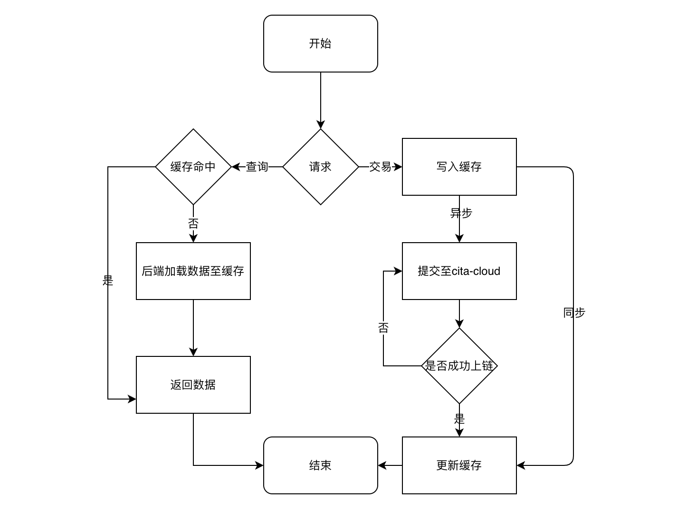
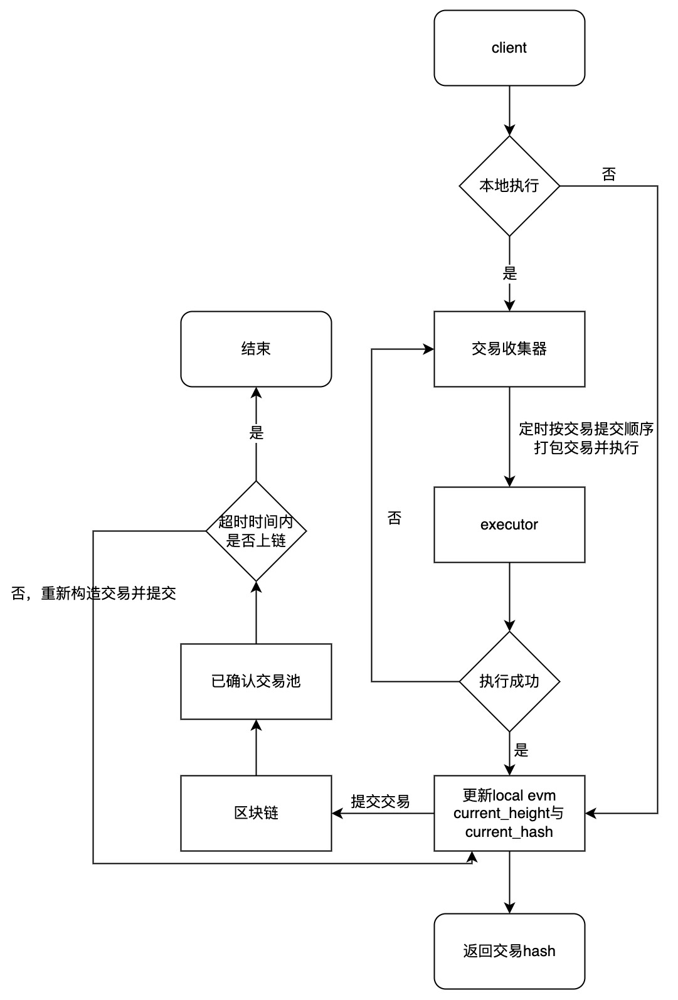
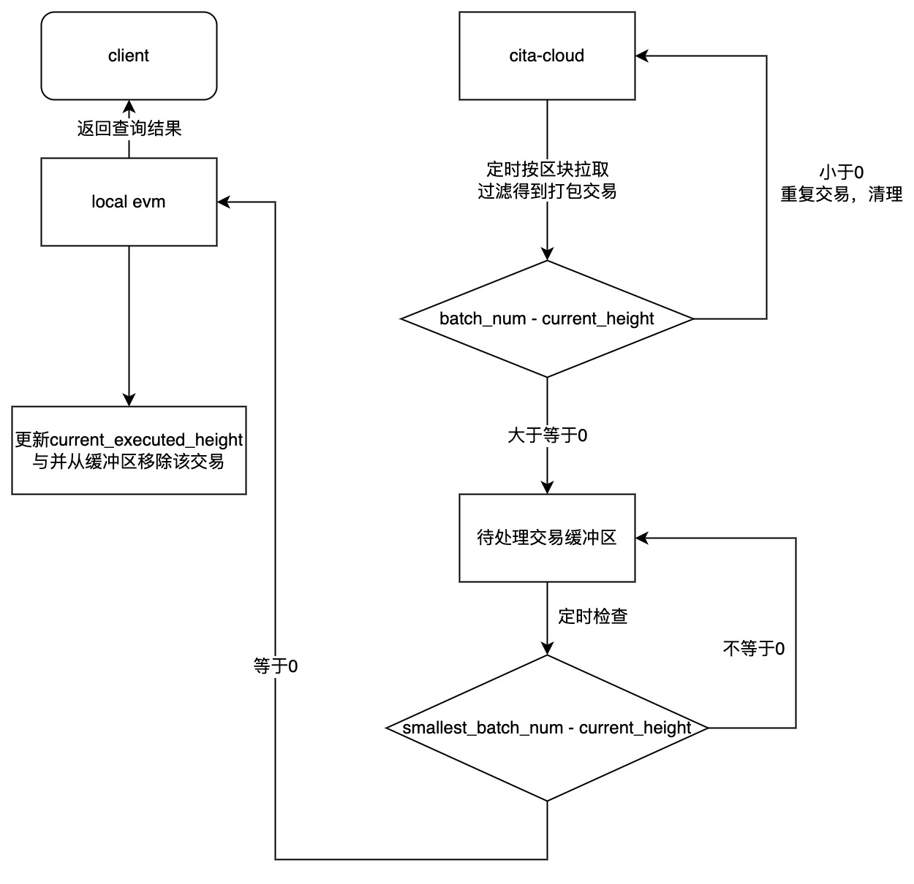

# cache
## 设计
cache服务分为读缓存与写缓存两部分

- 读缓存 
  - 旁路缓存模式，缓存数据懒加载，首次访问查询[cita-cloud](https://github.com/cita-cloud)，后续查询从缓存加载数据
  - 所有缓存设置超时时间，并通过**主动清除**与**被动清除**两种模式确保数据被清除
- 写缓存
  - 所有交易发送至缓存，会被缓存至FIFO队列，定时批量发送至[cita-cloud](https://github.com/cita-cloud)
  - 合约读缓存的数据会在向该合约发送交易并上链成功之后，清除相应读缓存数据
  - 后续参考rollup设计实现

## 实现
web server使用 [rocket](https://rocket.rs/) web框架实现，接口文档使用[swagger](https://swagger.io/)实现，使用[redis](https://redis.io/)存储缓存数据，
并使用RDB+AOF方式持久化数据，使用重试客户端连接[cita-cloud](https://github.com/cita-cloud)
### 实现细节
#### redis使用优化  
当Redis内存超出物理内存的限制时，内存的数据会开始和磁盘产生频繁的交换（swap）。交换会让Redis的性能急剧下降，对于访问量比较大的的Redis来说，存储效率太慢基本上等于不可用。
- redis侧
  - 设置maxmemory限制最大内存，设置maxmemory-policy为volatile-lru，仅驱逐设置过期时间的key，不设置超时时间的key默认不驱逐
  - 设置hz为10，每秒10次随机清除未访问的过期key
  - 设置notify-keyspace-events为Ex，仅开启键事件通道与expired事件的通知
- 服务侧
  - 收集10s内过期的key，订阅redis键事件通道，
    - 若收到expired事件则移除该key
    - 否则通过主动访问，惰性删除
#### 读缓存
- key：由三部分组成，分别是前缀，reids数据类型，业务参数，例如cache:val:block_by_number_1, cache:val:system_config, cache:hash:hash_to_tx
- 调用call调用智能合约时，缓存调用结果值
- 查询请求会先查询缓存
  - 命中：延长缓存时间，直接返回，
  - 未命中：查询cita-cloud后，设置超时时间，加载至缓存，然后返回


#### 写缓存
##### 交易结构
```asm
#[derive(Default, Debug, Deserialize, Serialize, Clone)]
pub struct Package {
    //local executor block height
    #[tag = 0]
    pub batch_number: u64,
    //Block encode
    #[tag = 1]
    pub block: Vec<u8>,
}
transaction.data = serialize(package);
```
##### 节点分类
- Master：收集用户提交的交易，本地执行，排序，提交至L1
  - 交易池：使用redis zset实现，zset member为交易hash，score为当前时间戳，交易原文存在hash表中，key为交易hash
  - 保存交易：用户提交的交易被批量打包执行，执行成功后将打包交易原文存入未提交交易池，当作普通交易处理


- Validator：拉取L1的交易，按顺序重放验证
  - 待处理交易缓冲区：redis zset实现，member为交易hash，score为batch_num - current_height
  - 取交易参数：
    - current_height：递增，最新的已本地执行成功的块高（local executor）+ 1
    - batch_num：拉取并遍历到的交易的batch_num
    - smallest_batch_num：待处理交易缓冲区中最小的score
  - 拉取交易：按区块从L1拉取交易，并过滤掉非cache提交的交易（sender过滤），并对交易进行排序
  - 验证交易：按照顺序调用executor执行交易
  - 查询：提供查询executor功能



